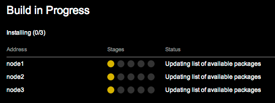
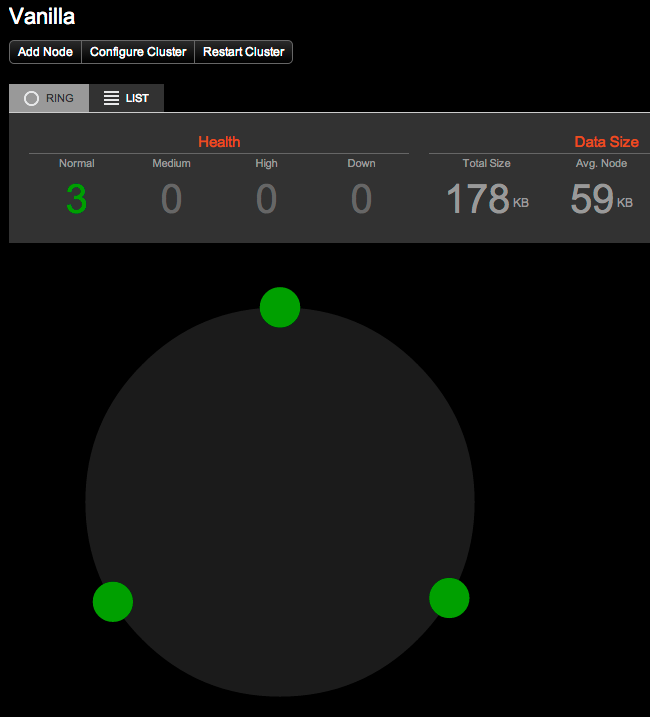

## 2.MultiNode Template

This Vagrant template sets up 4 separate VMs for creating a Cassandra cluster:

* node0 - [OpsCenter](http://www.datastax.com/what-we-offer/products-services/datastax-opscenter) host
* node[1-3] - base system (only Java pre-installed)

Notes:

* Depending on how much memory your host system has, you may need to lower the default memory size for each VM. Currently it's set to 3GB for each VM, but with all 4 running it may be too much for your host.

## Instructions

### Setup

If Vagrant has been installed correctly, you can bring up the 4 VMs with the following:

```
$ ./up-parallel.sh
```

Note: This will bring up each VM in series and then provision each in parallel. You can also just run `vagrant up` which does everything in series and will be slower.

When the up command is done, you can check the status of the 4 VMs:

```
$ vagrant status
Current machine states:

node0                     running (virtualbox)
node1                     running (virtualbox)
node2                     running (virtualbox)
node3                     running (virtualbox)
```

The `vagrant ssh` command will let you login to one node at a time. You can also use a for loop to run a command on all 4 VMs, for example:

```
$ for i in {0..3}; do vagrant ssh node$i -c 'uname -a'; done
Linux node0 3.2.0-23-generic #36-Ubuntu SMP Tue Apr 10 20:39:51 UTC 2012 x86_64 x86_64 x86_64 GNU/Linux
Linux node1 3.2.0-23-generic #36-Ubuntu SMP Tue Apr 10 20:39:51 UTC 2012 x86_64 x86_64 x86_64 GNU/Linux
Linux node2 3.2.0-23-generic #36-Ubuntu SMP Tue Apr 10 20:39:51 UTC 2012 x86_64 x86_64 x86_64 GNU/Linux
Linux node3 3.2.0-23-generic #36-Ubuntu SMP Tue Apr 10 20:39:51 UTC 2012 x86_64 x86_64 x86_64 GNU/Linux
```

### OpsCenter

First, let's confirm that OpsCenter is running:

```
$ vagrant ssh node0 -c "sudo service opscenterd status"
 * Cassandra cluster manager opscenterd is running
```

Next, connect to the OpsCenter web interface: <http://node0:8888/> which should start like the following:


Now we can use OpsCenter to create the cluster for us on node[1-3]. Click on Create Brand New Cluster and fill in the appropriate fields:

* Name: Change it or leave as default "Test Cluster"
* Package: DataStax Community 2.0.8
* Nodes: node1, node2, node3 (each on a new line)
* Node credentials: vagrant / vagrant

Click View Advanced Options to get a view of customizations you can control.

Click Build Cluster, then Accept Fingerprints.

OpsCenter will switch to the Build in Progress status page:



Once all packages are installed and configured, the agents will start up up. Once all agents are running, OpsCenter will switch to the dashboard showing your 3-node cluster up and running: 



To put some load on the Cassandra cluster (and see the reaction in OpsCenter), try running the Cassandra Stress tool:

```
$ vagrant ssh node1
$ cassandra-stress -d node1 -n 200000
Created keyspaces. Sleeping 1s for propagation.
total,interval_op_rate,interval_key_rate,latency,95th,99.9th,elapsed_time
22479,2247,2247,20.2,50.6,329.4,10
64491,4201,4201,14.2,37.1,87.1,20
116785,5229,5229,11.9,30.2,87.1,30
174151,5736,5736,10.8,25.3,86.6,40
200000,2584,2584,10.7,23.8,57.4,45
```

From here, you can learn more about OpsCenter:

* [OpsCenter Tutorial](http://www.datastax.com/resources/tutorials/overview-opscenter) (video)
* [OpsCenter Documentation](http://www.datastax.com/documentation/opscenter/5.0/opsc/about_c.html)
* [Using OpsCenter](http://www.datastax.com/documentation/opscenter/4.1/opsc/online_help/opscUsing_g.html)


### Shut Down

To cleanly shut down all 4 VMs:

```
$ for i in {0..3}; do vagrant ssh node$i -c 'sudo shutdown -h now'; done
```

To destroy all 4 VMs:

```
$ vagrant destroy -f
```
