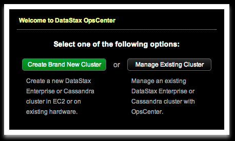
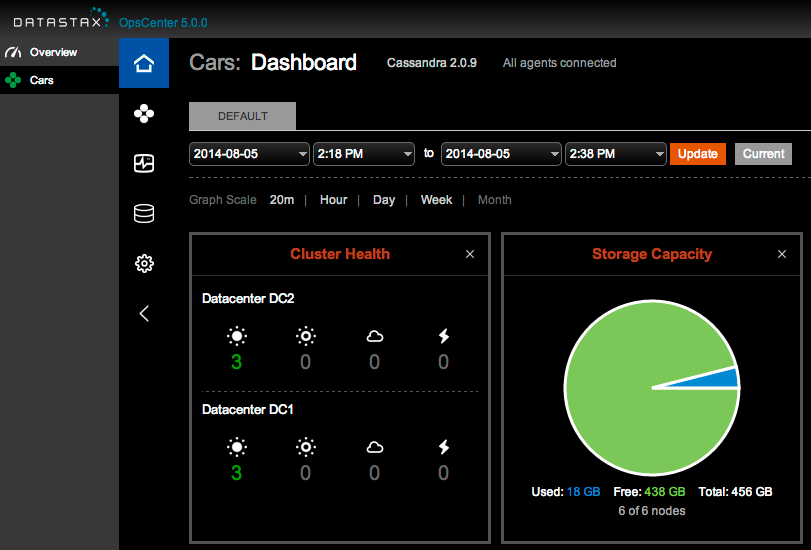

## 3.MultiDC Template

This Vagrant template sets up 7 separate VMs for creating a multi-datacenter Cassandra cluster:

* node10 - [OpsCenter](http://www.datastax.com/what-we-offer/products-services/datastax-opscenter) host
* node[11-16] - [Cassandra](http://planetcassandra.org/cassandra/) nodes

The Vagrantfile in this example creates the VMs, installs OpsCenter and Cassandra, then configures the 6-node cluster into two different logical datacenters (DC1 and DC2).

Notes:

* Depending on how much memory your host system has, you may need to lower the default memory size for each VM. Currently it's set to 1500 MB for each VM, but with all 7 running it may be too much for your host.

## Instructions

### Setup

If Vagrant has been installed correctly, you can bring up the 7 VMs with the following:

```
$ ./up-parallel.sh
```

Note: This will bring up each VM in series and then provision each in parallel. You can also just run `vagrant up` which does everything in series and will be slower.

When the provisioning process is done, you can check the status of the 7 VMs:

```
$ vagrant status
Current machine states:

node10                     running (virtualbox)
node11                     running (virtualbox)
node12                     running (virtualbox)
node13                     running (virtualbox)
node14                     running (virtualbox)
node15                     running (virtualbox)
node16                     running (virtualbox)
```

Log in to one node and check the Cassandra cluster status. You should see all 6 nodes up and running:

```
$ vagrant ssh node11
$ nodetool status
Datacenter: DC1
===============
Status=Up/Down
|/ State=Normal/Leaving/Joining/Moving
--  Address        Load       Tokens  Owns (effective)  Host ID                               Rack
UN  10.211.55.113  86.26 KB   256     34.7%             f42d6001-9e74-4249-b510-35c4942ea059  RAC1
UN  10.211.55.115  69.56 KB   256     31.4%             b4f89779-d832-4c9e-9cde-03b116dfde0f  RAC1
UN  10.211.55.111  41.07 KB   256     33.3%             0454cb56-fd91-4857-8ce5-60cbf39a8ff3  RAC1
Datacenter: DC2
===============
Status=Up/Down
|/ State=Normal/Leaving/Joining/Moving
--  Address        Load       Tokens  Owns (effective)  Host ID                               Rack
UN  10.211.55.116  69.92 KB   256     34.3%             37ee2707-e133-4557-9c14-577712f8e9d8  RAC1
UN  10.211.55.112  57.16 KB   256     33.0%             4830a1ad-88c2-4f8a-96a0-11480614c00e  RAC1
UN  10.211.55.114  65.56 KB   256     33.2%             6fda6f3f-8f94-4f80-a228-09d415dfd70f  RAC1
```

### OpsCenter

Now we can connect OpsCenter to our cluster. First, let's confirm that OpsCenter is running:

```
$ vagrant ssh node10 -c "sudo service opscenterd status"
 * Cassandra cluster manager opscenterd is running
```

Next, connect to the OpsCenter web interface: <http://node10:8888/> which should start like the following:



Now we can use OpsCenter to connect with the existing cluster on node[1-6]. Click on Manage Existing Cluster, type in `node11`, then click Save Cluster. (OpsCenter just needs to connect with one node in a cluster, then it will discover the rest.)

Once OpsCenter has discovered all of the cluster hosts, it should show the 6-node cluster in two datacenters (DC1, DC2):



Click around in the OpsCenter UI to see the different views and options.

To put some load on the Cassandra cluster (and see the reaction in OpsCenter), try running the Cassandra Stress tool:

```
$ vagrant ssh node11
$ cassandra-stress -d node11 -n 200000
Created keyspaces. Sleeping 1s for propagation.
total,interval_op_rate,interval_key_rate,latency,95th,99.9th,elapsed_time
22479,2247,2247,20.2,50.6,329.4,10
64491,4201,4201,14.2,37.1,87.1,20
116785,5229,5229,11.9,30.2,87.1,30
174151,5736,5736,10.8,25.3,86.6,40
200000,2584,2584,10.7,23.8,57.4,45
```

From here, you can learn more about OpsCenter:

* [OpsCenter Tutorial](http://www.datastax.com/resources/tutorials/overview-opscenter) (video)
* [OpsCenter Documentation](http://www.datastax.com/documentation/opscenter/5.0/opsc/about_c.html)
* [Using OpsCenter](http://www.datastax.com/documentation/opscenter/4.1/opsc/online_help/opscUsing_g.html)

To learn more about the configuration performed in this template, see:

* [Initializing a multiple node cluster (multiple data centers)](http://www.datastax.com/documentation/cassandra/2.0/cassandra/initialize/initializeMultipleDS.html)

### Shut Down

To cleanly shut down all 7 VMs:

```
$ for i in {0..6}; do vagrant ssh node1$i -c 'sudo shutdown -h now'; done
```

To destroy all 7 VMs:

```
$ vagrant destroy -f
```
